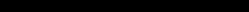
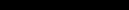
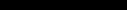
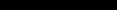
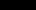

# 🎓 Smart Attendance System (Beyond Biometrics)

[](https://www.bahria.edu.pk/)
[](https://www.bahria.edu.pk/)
[](https://www.bahria.edu.pk/)
[](#)

---

## 📋 Table of Contents

- [Project Overview](#project-overview)
- [Problem Statement](#problem-statement)
- [Milestone 1: Requirements](#milestone-1-requirements)
- [Milestone 2: System Modeling](#milestone-2-system-modeling)
- [Milestone 3: Design & Architecture](#milestone-3-design--architecture)
- [Milestone 4: Testing & Project Management](#milestone-4-testing--project-management)
- [👥 Contributors](#-contributors)
- [References](#references)

---

## Project Overview

The **Smart Attendance System (Beyond Biometrics)** is a comprehensive software solution developed for Bahria University Islamabad (SEN 220 - Software Engineering Course). This system leverages multiple automated channels including facial recognition, GPS geo-fencing, QR code scanning, and Wi-Fi/BLE proximity detection to capture attendance seamlessly, accurately, and in real-time without dedicated hardware.

### Key Features

✨ **Multi-Channel Verification**
- Facial recognition via device camera
- GPS geo-fencing validation
- Time-limited QR code scanning
- Wi-Fi/BLE proximity detection

🔒 **Security & Privacy**
- Face embeddings stored as hashed vectors (never raw images)
- HMAC-signed QR codes with expiry
- JWT token-based authentication
- Comprehensive audit trail

📊 **Analytics & Reporting**
- Real-time attendance dashboards
- Daily, weekly, and semester reports
- CSV/PDF export functionality
- Role-based access control

📱 **Multi-Platform Support**
- React Native mobile app (Android 10+, iOS 14+)
- React.js web portal
- REST API for LMS/ERP integration

---

## Problem Statement

Traditional attendance systems rely on manual registers or basic biometric hardware (fingerprint readers, RFID cards). These approaches are:

- ❌ Prone to proxy attendance and "buddy punching"
- ❌ Subject to hardware failure and high maintenance costs
- ❌ Create administrative bottlenecks in large universities
- ❌ Result in inaccurate records

**Bahria University Challenge:** With hundreds of students per batch, manual and basic biometric systems create significant administrative overhead and record inaccuracies.

**Our Solution:** The Smart Attendance System leverages multiple automated verification channels to eliminate these pain points while maintaining data privacy and system reliability.

---

# Milestone 1: Requirements

## 1.1 Project Scope

### IN SCOPE:
- ✅ Automated attendance via facial recognition, GPS geo-fencing, QR codes, and BLE/Wi-Fi proximity
- ✅ Role-based access: Admin, Instructor, Student
- ✅ Real-time dashboards, attendance statistics, and analytics
- ✅ Notification system (email, SMS, push) for absentees and low-attendance warnings
- ✅ Reporting module: per student / class / department (CSV/PDF export)
- ✅ REST API integration with university LMS/ERP
- ✅ Mobile app (Android/iOS) and web portal

## 1.2 Functional Requirements

| FR # | Requirement | Priority |
|------|-------------|----------|
| FR-01 | System shall allow students to mark attendance via facial recognition using the device camera. | High |
| FR-02 | System shall verify student physical location via GPS geo-fencing before marking attendance. | High |
| FR-03 | System shall generate time-limited, single-use HMAC QR codes for each class session. | High |
| FR-04 | System shall detect student Wi-Fi/BLE proximity to classroom AP as secondary verification. | Medium |
| FR-05 | System shall allow instructors to manually override attendance records with a mandatory reason. | High |
| FR-06 | System shall send automated alerts when attendance falls below 75%. | High |
| FR-08 | System shall generate daily, weekly, and semester attendance reports. | High |
| FR-10 | System shall maintain an audit trail of all manual corrections with timestamps and actor ID. | High |

## 1.3 Non-Functional Requirements

| NFR # | Category | Requirement |
|-------|----------|-------------|
| NFR-01 | Performance | Facial recognition verification shall complete within 3 seconds under normal network. |
| NFR-02 | Scalability | System shall support 500 concurrent active class sessions without degradation. |
| NFR-03 | Availability | System shall maintain 99.5% uptime; maintenance only during off-peak hours. |
| NFR-04 | Security | Face data stored as hashed embeddings (vector), never as raw images. |
| NFR-05 | Security | All API communication uses TLS 1.3; JWT tokens expire within 24 hours. |
| NFR-06 | Usability | Student face enrollment (onboarding) completable in under 5 minutes. |
| NFR-07 | Reliability | Mobile app queues attendance locally if offline and syncs on reconnection. |
| NFR-08 | Compatibility | Mobile app supports Android 10+ and iOS 14+. |

## 1.4 Use Case Diagram


### Use Case Descriptions

#### UC-01: Mark Attendance

| Field | Detail |
|-------|--------|
| **Use Case ID** | UC-01 |
| **Use Case Name** | Mark Attendance |
| **Actor(s)** | Student, Instructor, System |
| **Pre-condition** | An active session exists; student is enrolled and authenticated; valid QR code is available. |
| **Main Flow** | 1. Instructor starts a session and generates QR (UC-02) <br> 2. Student opens the attendance interface <br> 3. Student scans the session QR code <br> 4. System validates the QR code and student enrollment <br> 5. System records attendance as Present with a timestamp <br> 6. System displays a confirmation to the student |
| **Alternate Flow** | **A1:** If QR code has expired, system rejects the scan and logs the student as Absent <br> **A2:** If student has already marked attendance, system displays "Already marked" message |
| **Post-condition** | Attendance record saved with timestamp; visible to instructor in real time; reflected in reports |
| **Exception** | If QR code is invalid or unrecognized, system rejects the request and displays an error message |

#### UC-02: Generate Session QR

| Field | Detail |
|-------|--------|
| **Use Case ID** | UC-02 |
| **Use Case Name** | Generate Session QR |
| **Actor(s)** | Instructor, Admin, System |
| **Pre-condition** | Instructor/Admin is authenticated; a scheduled class session exists in the system. |
| **Main Flow** | 1. Instructor selects the relevant course and session <br> 2. Instructor clicks "Generate QR" <br> 3. System creates a unique, time-stamped QR code linked to the session <br> 4. QR code is displayed on screen for students to scan <br> 5. System activates an expiry timer for the QR code |
| **Alternate Flow** | **A1:** If QR expires mid-session, instructor can regenerate a new code for the same session <br> **A2:** If no active session is found for the selected slot, system displays an error |
| **Post-condition** | Active QR code linked to the session is available for student scanning; becomes invalid after expiry or session ends |
| **Exception** | If system fails to generate QR due to a server error, instructor is notified and prompted to retry |

#### UC-03: Generate Report

| Field | Detail |
|-------|--------|
| **Use Case ID** | UC-03 |
| **Use Case Name** | Generate Report |
| **Actor(s)** | Instructor, Admin, System |
| **Pre-condition** | User is authenticated with Instructor or Admin role; attendance records exist in the system. |
| **Main Flow** | 1. User navigates to the Reports section <br> 2. User selects filter criteria (course, student, date range) <br> 3. System retrieves matching attendance records <br> 4. System displays a summarized report with present/absent counts and percentages <br> 5. User optionally exports the report as PDF or CSV |
| **Alternate Flow** | **A1:** If no records match the selected filters, system displays "No records found" <br> **A2:** If export fails, system shows an error message and prompts the user to retry |
| **Post-condition** | Report is displayed and/or downloaded successfully |
| **Exception** | If the system times out while fetching large datasets, user is notified and advised to narrow the filter range |

#### UC-04: Manual Attendance Override

| Field | Detail |
|-------|--------|
| **Use Case ID** | UC-04 |
| **Use Case Name** | Manual Attendance Override |
| **Actor(s)** | Instructor, Admin, System |
| **Pre-condition** | Session has ended or is active; instructor has edit rights; target student is enrolled in the course. |
| **Main Flow** | 1. Instructor searches for the target student <br> 2. Selects the relevant session record <br> 3. Changes attendance status (Present / Absent / Late / Excused) <br> 4. Provides a mandatory reason for the override <br> 5. System validates the changes <br> 6. System saves the updated record with an audit log entry |
| **Alternate Flow** | **A1:** If instructor lacks permissions, admin approval is required before the override is applied |
| **Post-condition** | Attendance record updated successfully; reason and audit log stored; reports updated automatically |
| **Exception** | Override after 48-hour lock requires admin approval to unlock and edit the record |

#### UC-05: Manage Users

| Field | Detail |
|-------|--------|
| **Use Case ID** | UC-05 |
| **Use Case Name** | Manage Users |
| **Actor(s)** | Admin, System |
| **Pre-condition** | The user must have an Admin role. |
| **Main Flow** | 1. Admin navigates to User Management <br> 2. Admin creates, edits, or deactivates a user account <br> 3. System validates input (unique email, required fields) <br> 4. System saves changes and updates access permissions |
| **Alternate Flow** | **A1:** If email already exists, system rejects the entry and highlights the conflict <br> **A2:** System can save locally if offline |
| **Post-condition** | User accounts are active/inactive as intended |
| **Exception** | If bulk import CSV contains invalid rows, system rejects those entries, reports errors per row, and imports the valid ones |

---

# Milestone 2: System Modeling

## 2.1 Context Diagram (Level 0 DFD)



**Description:** The context diagram shows the Smart Attendance System at the highest level, depicting the system as a single bubble with external entities (Students, Instructors, Admin) and external systems (LMS, ERP, Email/SMS Service, Maps API, Face Recognition API).

## 2.2 Level 1 DFD — Major Processes



**Key Processes:**
1. **P1 - Authentication & Authorization:** Handles user login and role-based access control
2. **P2 - Session Management:** Creates class sessions and generates QR codes
3. **P3 - Verification Engine:** Performs facial recognition, geo-fence validation, and BLE proximity checks
4. **P4 - Attendance Recording:** Records and maintains attendance states
5. **P5 - Reporting & Analytics:** Generates reports and sends notifications

## 2.3 Class Diagram


**Core Classes:**
- **User:** Base class for all system users (id, email, password_hash, role)
- **Student:** Extends User (enrollment_no, department, face_embedding_hash)
- **Instructor:** Extends User (employee_id, department)
- **Admin:** Extends User (admin_level, permissions)
- **Course:** Represents academic courses (course_code, course_name, credit_hours)
- **CourseSection:** Specific section of a course (section_code, room, schedule)
- **Session:** Class session instance (start_time, end_time, qr_hash, status)
- **AttendanceRecord:** Individual attendance entry (status, method_used, timestamp)
- **AuditLog:** Tracks all manual corrections (action_type, actor_id, reason)

## 2.4 Sequence Diagram — Mark Attendance


**Flow:**
1. Student initiates attendance marking
2. System requests face capture from camera
3. Face Verification Service processes the image
4. Verification Service validates against enrolled embedding
5. System checks GPS geo-fence validity
6. Attendance Service records the attendance
7. Notification Service sends confirmation
8. Student receives success message

## 2.5 Activity Diagram — Student Marks Attendance



**Steps:**
- Start: Student opens app
- Scan QR code
- Decision: QR valid?
- If YES: Capture face
- Decision: Face verified?
- If YES: Check geo-fence
- Decision: Location valid?
- If YES: Record attendance → Success notification → End
- If NO at any step: Show error message → End

## 2.6 State Diagram — AttendanceRecord Lifecycle



**States:**
- **NOT_MARKED:** Initial state, no attendance yet
- **MARKED:** Attendance marked via verification
- **LATE:** Student marked attendance after session grace period
- **ABSENT:** Student did not mark attendance
- **EXCUSED:** Admin/Instructor marked as excused with reason
- **CORRECTED:** Record was manually overridden with audit entry
- **LOCKED:** 48-hour immutable lock, requires admin unlock for correction

---

# Milestone 3: Design & Architecture

## 3.1 System Architecture — Layered MVC + Microservices


**Architecture Overview:**

```
┌─────────────────────────────────────────────────────────────┐
│             Presentation Layer (View)                         │
│  React Native Mobile App  |  React.js Web Portal              │
└─────────────────────────────────────────────────────────────┘
                                │
┌─────────────────────────────────────────────────────────────┐
│         API Gateway (Nginx/Kong) — Port 443                   │
│  Routing | Rate Limiting | SSL/TLS | Load Balancing           │
└─────────────────────────────────────────────────────────────┘
                                │
┌─────────────────────────────────────────────────────────────┐
│        Controller Layer (REST API Controllers)                │
│  Express.js Routers — Auth | Session | Attendance | Report    │
└─────────────────────────────────────────────────────────────┘
                                │
┌─────────────────────────────────────────────────────────────┐
│    Business Logic Layer (Microservices)                       │
│  Auth Svc | Session Svc | Verification Svc | Attendance Svc  │
│  Notification Svc | Reporting Svc                             │
└─────────────────────────────────────────────────────────────┘
                                │
┌─────────────────────────────────────────────────────────────┐
│    Data Access Layer (Repository Pattern / ORM)               │
│  Sequelize/Prisma | Connection Pooling | Redis Caching        │
└─────────────────────────────────────────────────────────────┘
                                │
┌─────────────────────────────────────────────────────────────┐
│           Database Layer                                      │
│  PostgreSQL (relational) | Redis (cache) | MongoDB (logs)     │
└─────────────────────────────────────────────────────────────┘
```

## 3.2 Microservices Breakdown

| Service | Port | Responsibility | Tech Stack |
|---------|------|-----------------|------------|
| **Auth Service** | 3001 | User login, JWT issuance, role management, token refresh | Node.js, bcrypt, jsonwebtoken |
| **Session Service** | 3002 | Create/manage class sessions, HMAC-signed QR generation | Node.js, UUID, crypto |
| **Verification Service** | 3003 | Face recognition, geo-fence calculation, BLE proximity checks | Python (FastAPI), TensorFlow/FaceNet |
| **Attendance Service** | 3004 | Record CRUD, state machine, override workflow | Node.js, PostgreSQL, Sequelize |
| **Notification Service** | 3005 | Email/SMS/push dispatch with retry logic | Node.js, Firebase FCM, Twilio |
| **Reporting Service** | 3006 | Aggregate data, generate PDF/CSV exports | Node.js, PDFKit, ExcelJS |
| **API Gateway** | 443 | Routing, rate limiting, SSL, load balancing | Nginx / Kong Gateway |

## 3.3 Database Schema (Key Tables)

| Table | Primary Key | Key Columns | Foreign Keys |
|-------|-------------|-------------|--------------|
| **users** | user_id (UUID) | name, email, role, password_hash, created_at | — |
| **students** | student_id (UUID) | enrollment_no, department, semester, face_embedding_hash | user_id → users |
| **instructors** | instructor_id (UUID) | employee_id, department | user_id → users |
| **courses** | course_id (UUID) | course_code, course_name, credit_hours | — |
| **course_sections** | section_id (UUID) | section_code, room, schedule_json | course_id, instructor_id |
| **enrollments** | enrollment_id (UUID) | enrolled_at, status | student_id, section_id |
| **sessions** | session_id (UUID) | start_time, end_time, qr_hash, geo_fence_json, status | section_id |
| **attendance_records** | record_id (UUID) | status, method_used, timestamp, location_hash, state | session_id, student_id |
| **audit_logs** | log_id (UUID) | action_type, actor_id, reason, old_value, new_value | record_id |
| **notifications** | notif_id (UUID) | type, message, channel, status, sent_at | student_id |

## 3.4 State Machine Diagram — Session Lifecycle


**Session States:**
- **SCHEDULED:** Session created, awaiting start time
- **ACTIVE:** Instructor starts session, students can mark attendance
- **GRACE_PERIOD:** Session ended, students have grace time (15 min)
- **CLOSED:** Grace period expired, attendance locked
- **FINALIZED:** Attendance report generated
- **CORRECTION:** Admin reopens for corrections (24-hour window)
- **CANCELLED:** Session cancelled before completion

**State Transitions:**
- SCHEDULED → ACTIVE (Instructor starts session)
- ACTIVE → GRACE_PERIOD (End time reached)
- GRACE_PERIOD → CLOSED (Grace period expires)
- CLOSED → CORRECTION (Admin reopens)
- CORRECTION → CLOSED (Correction window closes)
- CLOSED → FINALIZED (Report generated)
- Any → CANCELLED (Session cancellation)

---

# Milestone 4: Testing & Project Management

## 4.1 Test Plan

### 4.1.1 Scope of Testing

- **Unit Testing:** Individual service functions and business logic modules
- **Integration Testing:** Service-to-service communication and database operations
- **System Testing:** Complete end-to-end user flows from mobile app to database
- **Performance Testing:** 500 concurrent users load test
- **Security Testing:** SQL injection, JWT tampering, QR replay attacks

### 4.1.2 Test Tools & Frameworks

| Layer | Tool | Purpose |
|-------|------|---------|
| **Unit Tests** | Jest, Mocha | JavaScript/Node.js unit testing |
| **Unit Tests** | PyTest | Python service unit testing |
| **Integration Tests** | Supertest, Mocha | API endpoint integration testing |
| **E2E Tests** | Cypress, Detox | Mobile app & web portal E2E |
| **Load Testing** | Apache JMeter, k6 | Performance under 500 concurrent users |
| **Security Tests** | OWASP ZAP, Burp Suite | Vulnerability scanning |
| **CI/CD** | GitHub Actions | Automated test execution on commits |

## 4.2 Sample Test Cases

| TC # | Type | Module | Test Scenario | Input | Expected Output | Pass Criteria |
|------|------|--------|---------------|-------|-----------------|---------------|
| TC-01 | Unit | Verification | Match known face | Student face image | PASS, conf. 0.93 | conf ≥ 0.85 |
| TC-02 | Unit | Verification | Reject unknown face | Stranger's image | FAIL, conf. 0.41 | conf < 0.85 |
| TC-03 | Unit | Session Svc | Unique QR per session | sessionID: abc-123 | Unique hash, 600s TTL | Hash ≠ prev session |
| TC-04 | Unit | Geo-fence | Student within range | Coords ≤50m from room | Within: TRUE | Result is TRUE |
| TC-05 | Unit | Geo-fence | Student outside range | Coords 300m away | Within: FALSE | Result is FALSE |
| TC-06 | Integration | Attend. + DB | Record saved after verify | Verified payload | DB: status=PRESENT | Record in DB correct |
| TC-07 | Integration | Notif + Attend. | Alert at <75% attend. | Student attend.=60% | Email+push triggered | Notif record created |
| TC-08 | Integration | Auth + Gateway | JWT needed on routes | No Bearer token | HTTP 401 | 401 returned |
| TC-09 | System | Override | Instructor edits record | Override + reason | Record+audit+push | All 3 side-effects |

## 4.3 GitHub Version Control Workflow

**Repository:** `github.com/Shaariff53/attendance-management-report`

**Branch Strategy:**
- **main:** Production-ready code
- **develop:** Integration branch for features
- **feature/*:** Feature branches (feature/face-recognition, etc.)
- **hotfix/*:** Critical bug fixes

**PR Requirements:**
- ✅ 1 reviewer approval required
- ✅ All CI checks must pass
- ✅ Conventional commits format: `feat:`, `fix:`, `docs:`, `test:`, `chore:`

**Protection Rules:**
- Force push disabled on main
- Require status checks to pass
- Require branch to be up to date before merging

## 4.4 Team Roles & Responsibilities

| Team Member | Role | Primary Responsibilities |
|-------------|------|-------------------------|
| **Aliza Ibrar** | Project Manager / Backend Lead | Project planning, Gantt chart, risk register, Auth Service and Session Service development |
| **Shaariff Mujtaba** | ML & Verification Engineer | Face recognition (FaceNet/TensorFlow), Verification Service (Python/FastAPI), geo-fence algorithm |
| **Laiba Tahir** | Frontend Developer | React Native mobile app, UX/UI design, QR scanning + camera module |
| **Mahad Malik** | QA Engineer / DevOps | Test case design/execution, CI/CD pipeline, Reporting Service, final documentation |

## 4.5 Project Planning — Gantt Chart



**4-Week Project Timeline:**

| Task | Week 1 | Week 2 | Week 3 | Week 4 | Owners |
|------|--------|--------|--------|--------|--------|
| Requirements Analysis | ■■■■ | | | | Aliza |
| Use Case Modeling | ■■■■ | | | | Aliza, Shaariff |
| Context Diagram & DFD | | ■■■■ | | | Aliza |
| Class/Seq/Activity Diagrams | | ■■■■ | | | Shaariff, Laiba |
| Database Schema Design | | | ■■■■ | | Aliza, Mahad |
| Architecture Documentation | | | ■■■■ | | Aliza, Mahad |
| Verification Service Design | | ■■■■ | ■■ | | Shaariff |
| Mobile App Wireframes | | | ■■■■ | | Laiba |
| Test Plan & Test Cases | | | | ■■■■ | Mahad |
| GitHub Setup & CI/CD | | | | ■■■■ | Mahad |
| Risk Analysis | | | | ■■■■ | Aliza |
| Final Report Compilation | | | | ■■■■ | All |

## 4.6 Risk Analysis Register

| Risk # | Risk Description | Probability | Impact | Severity | Mitigation Strategy |
|--------|------------------|-------------|--------|----------|-------------------|
| **R-01** | Poor lighting degrades face recognition accuracy | High | High | 🔴 Critical | Brightness/contrast preprocessing; fallback to QR-only mode in low-light |
| **R-02** | Students share QR screenshot remotely | Medium | High | 🔴 Critical | HMAC time-limited QR (10 min) + dynamic challenge; combined with geo-fence |
| **R-03** | GPS location spoofing by students | Medium | High | 🔴 Critical | Cross-validate GPS with BLE/Wi-Fi RSSI; flag impossible location changes |
| **R-04** | Server overload during peak attendance | Medium | High | 🔴 Critical | Docker horizontal scaling; Nginx load balancer; Redis caching for sessions |
| **R-05** | Privacy concerns over facial biometric data | Low | High | 🟠 High | Store only face embeddings (vectors), not raw images; PDPA-compliant policy |
| **R-06** | Device incompatible or app not installed | Medium | Medium | 🟠 High | Web portal fallback; QR-only attendance mode without facial recognition |
| **R-07** | Internet outage during classroom session | Low | Medium | 🟡 Medium | Offline queue in mobile app; sync on reconnect; local BLE session beacon |

---

## 👥 Contributors

| Name | Enrollment No. | Role |
|------|---------------|------|
| Aliza Ibrar | 01-134242-019 | Project Manager / Backend Lead |
| Laiba Tahir | 01-134242-057 | Frontend Developer |
| Shaariff Mujtaba | 01-134242-112 | ML & Verification Engineer |
| Mahad Malik | 01-134242-084 | QA Engineer / DevOps |

**Course:** Software Engineering (SEN 220) | **Instructor:** Aima Zahoor  
**Institution:** Bahria University, Islamabad Campus | **Semester:** Spring 2026

---

## References

1. Sommerville, I. (2016). *Software Engineering* (10th ed.). Pearson Education.
2. Pressman, R. S. & Maxim, B. (2015). *Software Engineering: A Practitioner's Approach* (8th ed.). McGraw-Hill.
3. Fowler, M. (2003). *UML Distilled: A Brief Guide to the Standard Object Modeling Language* (3rd ed.). Addison-Wesley.
4. Schroff, F., Kalenichenko, D., & Philbin, J. (2015). FaceNet: A Unified Embedding for Face Recognition and Clustering. *CVPR 2015*.
5. OWASP Foundation. (2024). *OWASP Top Ten*. Retrieved from https://owasp.org/www-project-top-ten/
6. Google Developers. (2024). *Geofencing API Documentation*. Retrieved from https://developers.google.com/location-context/geofencing
7. GitHub Docs. (2024). *GitHub Actions Documentation*. Retrieved from https://docs.github.com/en/actions
8. Firebase Documentation. (2024). *Firebase Cloud Messaging*. Retrieved from https://firebase.google.com/docs/cloud-messaging
9. Pakistan Data Protection Authority. (2023). *Personal Data Protection Bill Overview*. Government of Pakistan.
10. Tanenbaum, A. & Van Steen, M. (2017). *Distributed Systems: Principles and Paradigms* (3rd ed.). Pearson.

---

**Last Updated:** May 9, 2026  
**Status:** ✅ Complete & Ready for Submission
